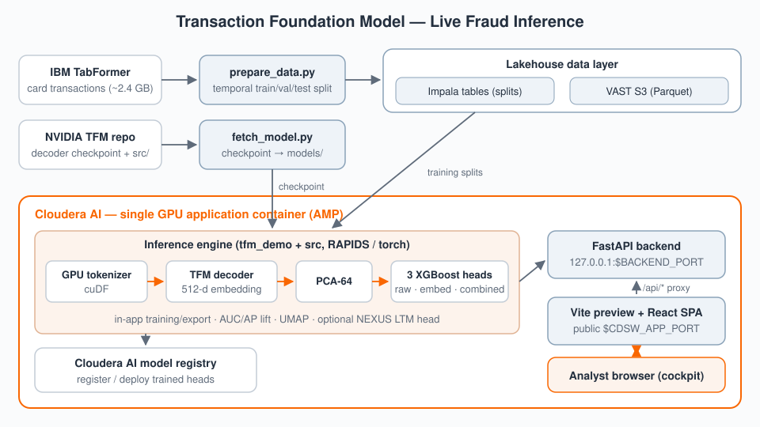

# Cloudera Blueprint: Transaction Foundation Model — Live Fraud Inference

## Table of Contents

- [Overview](#overview)
- [Demo](#demo)
- [Use Case](#use-case)
- [Key Features](#key-features)
- [Quickstart](#quickstart--guide)
- [Architecture / Software Components](#architecture--software-components)
- [Target Audience](#target-audience)
- [Repository Structure](#repository-structure)
- [Prerequisites](#prerequisites)
- [Hardware Requirements](#hardware-requirements)
- [Documentation](#documentation)

## Overview

This blueprint is a live fraud-inference cockpit for NVIDIA's Transaction Foundation
Model (TFM) running on Cloudera AI with a VAST S3 + Impala data layer. A raw payment
transaction flows through a GPU tokenizer and the TFM decoder to a 512-dimension
last-token embedding, then through PCA-64 into three XGBoost fraud heads (raw features /
embeddings / combined, plus an optional NEXUS long-term-memory head), and the React SPA
shows the resulting fraud probabilities, AUC/AP lift over the raw-feature baseline, live
UMAP views, and per-run training diagnostics. It deploys one-click as a Cloudera AI
Applied ML Prototype (AMP) and demonstrates how foundation-model embeddings improve
classical fraud models on the Cloudera platform.

## Demo

Reprise demo: coming soon.

Local demo material in the meantime: the demo script in
[`docs/demo-script.md`](docs/demo-script.md), the demo walkthrough in
[`docs/presentations/README_DEMO.md`](docs/presentations/README_DEMO.md), and the FSI
runbook in [`docs/presentations/demo-runbook-fsi.md`](docs/presentations/demo-runbook-fsi.md).
The UI can also be shown off-GPU via `docker compose up --build` (clearly-labelled
DEMO-FALLBACK mode, no live inference).

## Use Case

Card-fraud models built only on raw transaction features plateau: they miss the
sequential, behavioral signal in a card's transaction history. A transaction foundation
model pretrained on payment sequences captures that signal as dense embeddings — but
financial institutions need to see the lift on their own platform, with governed data,
before committing. This blueprint quantifies that outcome: it trains three XGBoost heads
on the TabFormer credit-card dataset (raw features vs. TFM embeddings vs. combined),
measures the AUC/AP lift live, and serves single-transaction inference through an
interactive cockpit — all on Cloudera AI, with training splits governed in Impala and
artifacts on VAST S3.

## Key Features

- **Measurable embedding lift** — side-by-side AUC/AP for raw-feature, embedding, and
  combined XGBoost heads, so the value of the foundation model is a number, not a claim.
- **Live GPU inference path** — each scored transaction runs the real stack (GPU
  tokenizer → TFM decoder → PCA-64 → heads) with its UMAP position rendered in the SPA.
- **One-click AMP deployment** — five declarative tasks (`.project-metadata.yaml`)
  install dependencies, build the SPA, fetch the checkpoint, prepare data, and start the
  application.
- **Lakehouse-governed data** — TabFormer temporal splits live in Impala tables and
  Parquet on VAST S3, configured from the app's Data dialog.
- **Graceful degradation** — boots in a clearly-labelled DEMO-FALLBACK mode when the
  GPU, checkpoint, or artifacts are unavailable, so the UI always demos.
- **In-app model lifecycle** — training/export runs from the UI on the backend GPU, with
  per-run validation curves, class separation, and feature-importance diagnostics, plus
  optional registration to the Cloudera AI model registry.

## Quickstart / Guide

1. Clone the repository.
2. **Deploy as an AMP (recommended):** in a Cloudera AI workspace, create a new project
   from this repo as an AMP; `.project-metadata.yaml` provisions the five tasks on an
   NVIDIA GPU runtime (JupyterLab / Python 3.12 / Nvidia GPU edition).
3. **Or run the same steps manually:**

   ```bash
   python deploy/install_deps.py       # pinned Python deps (GPU-aware)
   python deploy/build_frontend.py     # user-local Node + Vite build → app/frontend/dist
   python pipelines/fetch_model.py     # TFM checkpoint + blueprint src/ (idempotent)
   python pipelines/prepare_data.py    # TabFormer splits → Impala + VAST/S3 Parquet
   python app/serve_app.py             # uvicorn behind Vite preview on $CDSW_APP_PORT
   ```

4. Put VAST credentials in the untracked `.vast.env`; enter the Impala connection and
   database in the app's Data dialog (details in
   [`docs/impala-vast-s3-config.md`](docs/impala-vast-s3-config.md)).
5. Connectivity diagnostics: `python deploy/vast_probe.py` (VAST S3) and
   `python deploy/nexus_probe.py` (NEXUS LTM endpoint).
6. **Off-GPU UI demo:** `docker compose up --build`, then open http://localhost:8500
   (DEMO-FALLBACK mode).

The authoritative build/run guide is [`docs/APP_GUIDE.md`](docs/APP_GUIDE.md).

## Architecture / Software Components

The `prepare_data.py` pipeline downloads the IBM TabFormer credit-card dataset
(~2.4 GB), reproduces the temporal train / val / test split, and loads it into Impala
tables with Parquet artifacts on VAST S3; `fetch_model.py` downloads the NVIDIA TFM
decoder checkpoint and the blueprint's `src/` tokenizer package. A single Cloudera AI
application container then runs both halves of the demo: the FastAPI backend
(`tfm_demo/`) hosts the GPU inference engine — RAPIDS/cuDF tokenizer dataframes, the
torch/transformers decoder producing 512-d embeddings, PCA-64, three XGBoost heads, and
UMAP — privately on `127.0.0.1:$BACKEND_PORT`, while a Vite preview server publishes the
React SPA on `$CDSW_APP_PORT` and proxies `/api/*` inward. Training/export jobs launch
from the UI and run on the backend GPU; trained heads can be registered to the Cloudera
AI model registry, and an optional NEXUS long-term-memory head calls an external
endpoint.



## Target Audience

- ML engineers evaluating foundation-model embeddings for fraud and risk models
- Data scientists in financial services (payments, card fraud, transaction risk)
- Solution architects designing GPU inference applications on Cloudera AI
- Data engineers wiring Impala / VAST S3 data layers for ML workloads
- Sales engineers running the FSI fraud-inference demo

## Repository Structure

| Path | Description |
| --- | --- |
| `assets/` | Architecture diagram for this README |
| `deploy/` | Provisioning: `install_deps.py`, `build_frontend.py`, VAST/NEXUS connectivity probes, `docker/` images for the compose path |
| `docs/` | Extended documentation: `APP_GUIDE.md` (build/run), Impala/VAST config, NEXUS LTM design, demo scripts, presentations |
| `METADATA.yaml` | Catalog metadata for the Cloudera blueprint website |
| `.project-metadata.yaml` | Cloudera AI AMP manifest — five tasks (deps, SPA build, checkpoint fetch, data prep, application) |
| `workshop/` | Facilitator guide, glossary, and part 1/2 workshop materials |
| `ai/` | Training walkthrough notebook (inference code lives in `src/` + `tfm_demo/`) |
| `app/` | `serve_app.py` application entry point + `frontend/` React SPA cockpit |
| `app.py` | Thin backend entrypoint (`uvicorn app:app`) re-exporting the `tfm_demo` package |
| `data/` | Data-layer notes — transaction splits live on VAST/S3 and in Impala |
| `docker-compose.yml` | Off-GPU UI demo (backend + SPA in DEMO-FALLBACK mode) |
| `export_for_demo.py` | Exports trained artifacts/summaries for the demo UI |
| `governance/` | Model cards (TFM + XGBoost fraud heads) and policies |
| `models/` | Fetched TFM decoder checkpoint (weights gitignored) |
| `pipelines/` | AMP jobs: `fetch_model.py`, `prepare_data.py` |
| `requirements-demo.txt` | Web-layer Python dependencies |
| `requirements-gpu.txt` | Pinned NVIDIA stack: RAPIDS cu12, torch cu121, transformers, XGBoost |
| `requirements-nexus.txt` | Optional NEXUS LTM client dependencies |
| `src/` | Blueprint package from the NVIDIA TFM repo: tokenizer + decoder inference |
| `tests/` | Unit, data-quality, and AI-eval test conventions |
| `tfm_demo/` | The backend package: FastAPI app, inference engine, Impala/VAST readers, jobs, registry |

## Prerequisites

- Cloudera AI (CML) workspace with an NVIDIA GPU ML Runtime (JupyterLab, Python 3.12,
  Nvidia GPU edition; CUDA 12 driver) for REAL-mode inference and training
- Impala virtual warehouse reachable from the workspace (training splits are stored in
  and read from Impala tables)
- VAST S3 credentials in an untracked `.vast.env` (`VAST_ACCESS_KEY` /
  `VAST_SECRET_KEY` + endpoint settings) for Parquet artifacts
- Outbound HTTPS to download the TFM checkpoint (NVIDIA repo) and the TabFormer dataset
  (IBM Box, ~2.4 GB)
- Optional: NEXUS LTM endpoint access (`requirements-nexus.txt`, `deploy/nexus_probe.py`)
- For the off-GPU UI demo only: Docker with Compose

## Hardware Requirements

| Deployment | Minimum |
| --- | --- |
| Launchable / demo (AMP) | 4 CPU, 16 GB RAM, 1 NVIDIA GPU (CUDA 12, ~16 GB VRAM recommended), ~30 GB storage for wheels + dataset + checkpoint — per the AMP task profiles (2–4 CPU / 4–16 GB / 1 GPU) |
| Off-GPU UI demo (compose) | 2 CPU, 4 GB RAM — DEMO-FALLBACK mode only, no live inference |
| Production / enterprise | 16+ CPU, 64+ GB RAM, 1–2 NVIDIA A10G/L40S-class GPUs (24–48 GB VRAM) for concurrent inference and in-app training; Impala warehouse and VAST S3 sized to the transaction history retained |

## Documentation

- [`docs/APP_GUIDE.md`](docs/APP_GUIDE.md) — authoritative build/run guide
- [`docs/impala-vast-s3-config.md`](docs/impala-vast-s3-config.md) — Impala + VAST S3 configuration
- [`docs/nexus-ltm-design.md`](docs/nexus-ltm-design.md) — optional NEXUS long-term-memory head design
- [`docs/demo-script.md`](docs/demo-script.md) — demo script
- [`docs/presentations/README_DEMO.md`](docs/presentations/README_DEMO.md) — demo walkthrough
- [`docs/presentations/demo-runbook-fsi.md`](docs/presentations/demo-runbook-fsi.md) — FSI runbook
- [`docs/architecture/`](docs/architecture/) — architecture notes and ADRs
- [`workshop/README.md`](workshop/README.md) — facilitator guide and workshop materials
